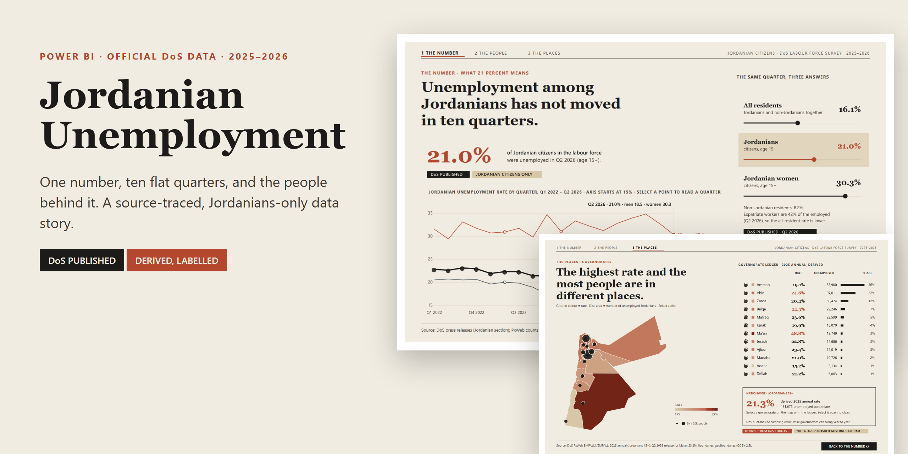
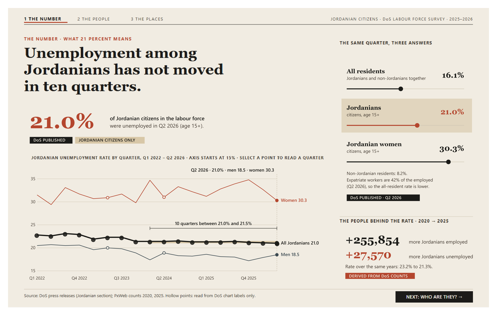
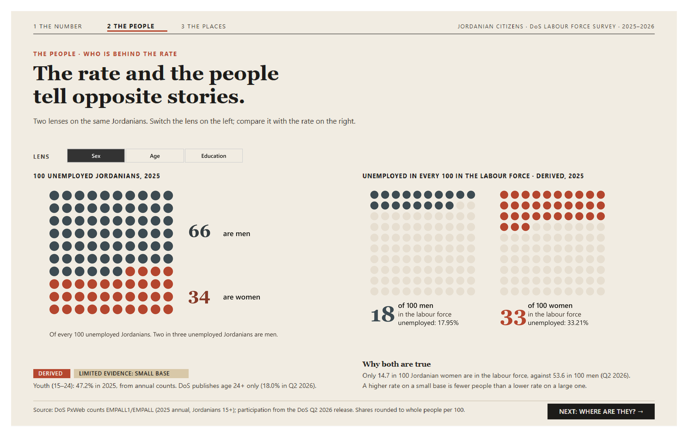
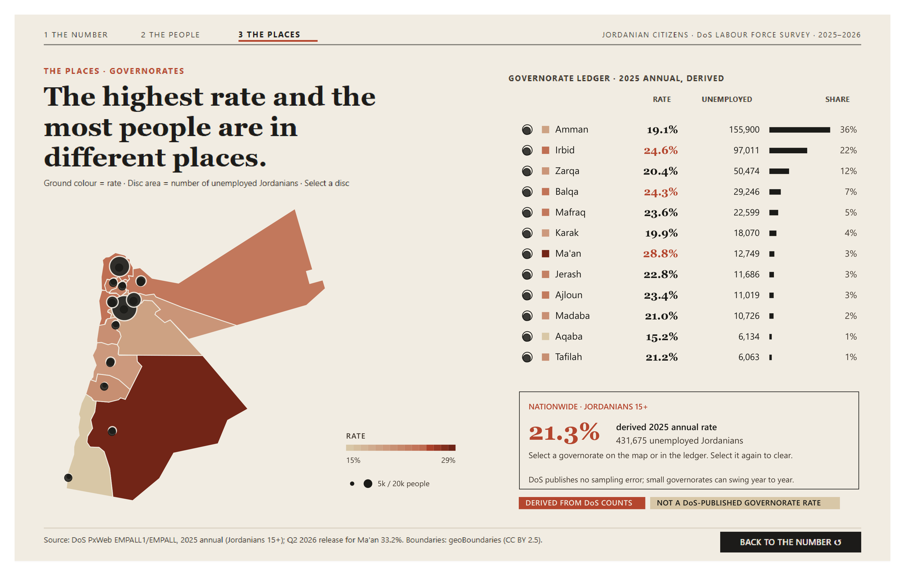

<p align="center"></p>

# Jordanian Unemployment 2025–2026

**A source-traced, Jordanians-only Power BI data story built on official Department of Statistics (DoS) releases.**
One headline number, ten flat quarters, and the people behind it.


-1C1B19)


**[Live preview site](https://musab-abukaraki-66.github.io/jordanian-unemployment-2025-2026/)** · **[Report PDF](docs/screens/desktop_export_default_state.pdf)** · **[Release v1.0.0](https://github.com/musab-abukaraki-66/jordanian-unemployment-2025-2026/releases/tag/v1.0.0)**

## The question
*What is the unemployment reality for Jordanian citizens in 2025–2026, once definitions, periods, gender, age and headline numbers are separated?*

## What the report shows
| Page | Headline | What you can do |
|---|---|---|
| **1 · The number** | Unemployment among Jordanians has not moved in ten quarters (21.0–21.5%). | Click any quarter on the line. See why all residents read 16.1% while Jordanians read 21.0% and Jordanian women 30.3%. |
| **2 · The people** | The rate and the people tell opposite stories. | Switch Sex / Age / Education over 100 unemployed Jordanians. 18 of 100 men and 33 of 100 women in the labour force are unemployed, yet 66 of every 100 unemployed Jordanians are men. |
| **3 · The places** | The highest rate and the most people are in different places. | Select a governorate by disc or ledger row. Ma'an has the highest derived rate (28.8%); Amman has 19.1% but 36% of all unemployed Jordanians. |

<p align="center">
  
</p>
<p align="center"><sub>Exported from Power BI Desktop 2.158. Full PDF: <a href="docs/screens/desktop_export_default_state.pdf">docs/screens/desktop_export_default_state.pdf</a></sub></p>

## Truth rules
- **Population = Jordanian citizens.** All-resident, non-Jordanian and modelled figures appear only as labelled reconciliation, never as a Jordanian statistic.
- Every number is one of three kinds, shown on screen as a label: **DoS PUBLISHED**, **DERIVED FROM DoS COUNTS** (annual 2025 rate 21.31%, governorate rates, youth 15–24 rate 47.2%), or **LIMITED EVIDENCE**.
- Quarterly rates are never averaged into an annual figure. Four chart points that exist only as DoS chart labels are drawn hollow.
- Each headline value traces to a DoS file, page and cross-check: [evidence table](08_Jordanian_Unemployment_Truth/03_Audit/EVIDENCE_TABLE.md), [audit](08_Jordanian_Unemployment_Truth/03_Audit/AUDIT_SUMMARY.md), [source manifest with SHA-256](08_Jordanian_Unemployment_Truth/02_Metadata/SOURCES.csv).

## Quick start (Windows, Power BI Desktop 2.158+)
```bash
git clone https://github.com/musab-abukaraki-66/jordanian-unemployment-2025-2026.git
cd jordanian-unemployment-2025-2026
python 09_Jordanian_Unemployment_Experience/05_PowerBI/scripts/set_data_folder.py
```
Open `09_Jordanian_Unemployment_Experience/05_PowerBI/pbip/JordanUnemployment.pbip`, click **Refresh** once (the model ships without cached data), then explore. In Desktop edit mode use **Ctrl+click** on buttons; in Reading view a normal click works.

## Repository map
| Path | Contents |
|---|---|
| `08_Jordanian_Unemployment_Truth/` | Evidence pack: official DoS publications (unmodified), manifest, audit, truth table, staging CSVs, acquisition scripts |
| `09_Jordanian_Unemployment_Experience/05_PowerBI/` | The report: PBIP project, curated CSVs, generator scripts, screens, verification |
| `09_Jordanian_Unemployment_Experience/01_Design/` | Four concepts and the final three frames, generated from real data |
| `09_Jordanian_Unemployment_Experience/04_Reviews/` | Six independent critic reviews |
| `docs/` | Index, screens, concepts, social preview |

## How it is built
Python generates the curated tables, the TMDL semantic model, the static page chrome and the PBIR report, so nothing is hand-edited. All figures are DAX measures that return SVG (data URIs) rendered in image tables; transparent scatter hotspots provide native click selection; one slicer drives the lens; page-navigation buttons form the chapter strip. Fonts: Georgia, Segoe UI. Canvas: 1440 × 900. Details and Desktop findings: [report README](09_Jordanian_Unemployment_Experience/05_PowerBI/README.md) and [final verification](09_Jordanian_Unemployment_Experience/05_PowerBI/FINAL_VERIFICATION.md).

Rebuild after editing a script (close Desktop first):
```bash
cd 09_Jordanian_Unemployment_Experience/05_PowerBI/scripts
python b01_data.py && python b03_model.py && python b02_art.py && python b04_report.py && python set_data_folder.py
```

## Integrity checks
Run `python 08_Jordanian_Unemployment_Truth/04_Staging/verify_repo.py` to check: SHA-256 of all 32 official files, headline values (10-quarter 21.0–21.5% band, latest 21.0%, derived 2025 rate 21.31%, each 100-dot lens sums to 100) and path hygiene.

## Design process
Four radically different concepts (spire relief map, persistence "treadmill", one hundred Jordanians, evidence ledger) were built with real data, reviewed by six independent critics (data truth, storytelling, visual design, Power BI feasibility, usability, performance) and merged into three pages. A true 3D relief was rejected: polygon area is not people and tall spires occlude each other. See [DESIGN_APPROVAL.md](09_Jordanian_Unemployment_Experience/DESIGN_APPROVAL.md).

## Limitations
- Governorate rates, the annual 2025 rate and the youth rate are derived from DoS counts, not published rates; DoS gives no sampling error.
- No standalone DoS release exists for Q2 2025 or annual 2025; Q2 2025 male and female values are implied by changes stated in later releases.
- Scatter click targets are calibrated to Desktop at 100% canvas zoom; the Power BI Service may differ by a few pixels.
- Georgia and Segoe UI come from the viewer's system. Desktop layout only, no mobile layout.

## Data and licences
Code and documentation: MIT. Data keeps its publisher's terms (DoS official statistics, geoBoundaries CC BY 2.5, World Bank CC BY 4.0 for the reconciliation file). See [DATA_LICENSES.md](DATA_LICENSES.md).

## Author
Musab AbuKaraki. Part of a portfolio of Power BI projects on real official public data.
